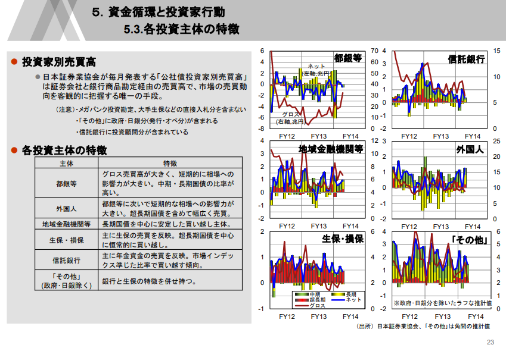
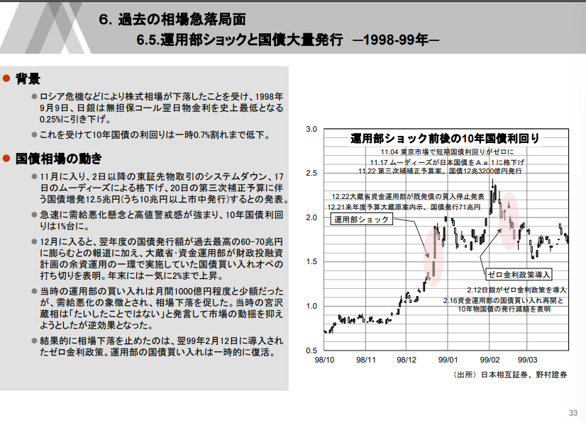
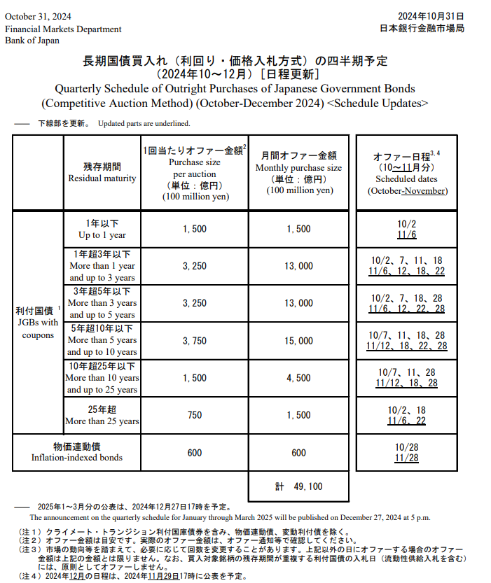

# 日本国債導入編

* 全体メモ
    * [md技法](https://qiita.com/aki_number16/items/9e4f98e5fb948370ceb6)　
    * プレビュー画面:Ctrl+Shift+V　　

* todo
    * webブラウジングで国債入札スケジュールを取得するコード
    * 入札のテールなどの情報はBBGからとれる？30yr JGB auction tail
    * 個人のgithubに挙げて見れるようにする
* 国債市場関連資料集
     * [財務省国債発行市場](https://www.mof.go.jp/jgbs/publication/debt_management_report/2022/saimu2022-2-1.pdf)
     * 古い資料だが国債市場の全体感がデータ出所とともにわかる: [日本の国債市場と投資家行動](https://www.carf.e.u-tokyo.ac.jp/wp/wp-content/uploads/2021/12/zaisei22-material.pdf)
* 日本国債村用語集
     * **強**、**甘**で価格の強い・弱いを表現する。
     * 村では、金利の単位については、10bpを厘(りん)、1bpを毛（もう）、0.1bpを糸（し）、0.01bpを忽（こつ）と呼ぶ。例：前日引けから0.5bp低下することは、5糸強。[参考リンク](https://saferich.biz/%E3%83%AD%E3%83%B3%E3%82%B0%E3%81%A8%E3%82%B7%E3%83%A7%E3%83%BC%E3%83%88/)
     * 

* 確認すべきデータ
    * 日本証券業協会が毎月発表する[公社債投資家別売買高](https://www.jsda.or.jp/shiryoshitsu/toukei/toushika/index.html)
    * ↑証券会社と銀行商品勘定経由の売買足高で市場の売買動向を客観的に把握する唯一の手段。

* その他メモ
    * 資金運用部ショック

* 国債入札基礎
    * 発行スケジュールは事前に財務省が公表。
    *  入札当日の午前10:30に財務省が表面利率を公表する。
    *  入札結果は午後12:35に財務省が公表する。
    *  平均落札価格と最低価格の差は「テール」。
    *  応札額の合計を落札額で割ったものが「応札倍率」。
    *  一般に、過去の入札に比べテールが大きかったり応札倍率が低かったりすると、入札は不調と評価される。需要の弱さが示されるため、債券は売り要因。
    *  定例発行は2y,5y,10y,30y,20yが毎月。40yと物価連動国債が四半期毎。
    *  入札方法は40年が利回りダッチ方式、物価連動国債が価格ダッチ、その他の年限が価格コンベンショナル方式。ダッチ方式は各落札者の入札価格にかかわらず均一の発行条件となる。（募入最低価格／募入最高利回り）
    *  第１非価格競争入札および第2非価格競争入札について
       *  第１非価格競争入札は、価格競争入札と同時に応募が行われ、発行予定額の20％を発行限度額とし、価格競争入札における加重平均価格を発行価格とする入札。PDのみ参加資格あり、直近2四半期の落札実績に応じて決められる各社ごとの応札限度額まで応札・落札可能。（40y・物価連動国債は対象外）
       *  **第2非価格競争入札**は、コンベンショナル方式における加重平均価格を発行価格（ダッチ方式の場合は発行価格）とする、価格競争入札の結果公表後に行われる入札。PDのみ参加資格があり、直近2四半期の応札実績に応じて決められる各社ごとの応札限度額まで落札可能。TDBと物価連動国債は対象外。応札限度額は価格競争入札および第１非価格競争入札における当該参加者の落札額の合計の10％相当額を超過しない額となる。
       *  詳細は[非価格競争入札入門](https://www.mof.go.jp/public_relations/finance/202209/202209e.pdf)
    *  非競争入札は、入札額が小規模の中小入札参加者に配慮した入札。対象は2y・5y・10y。入札者は価格競争入札または非競争入札のいづれか一方に限り応募可能。応募限度額が各入札参加者につき10億円
    *  即時リオープン方式とは、新発国債の元利払日と表面利率が既発債と同一である場合、原則として、その既発債と同一銘柄として追加発行（リオープン）する方式。これは**5年債**が対象となる。
       *　10y,20y,30y,40yについては、財務省のHPを参照。年度毎に変更される模様。[令和6年度の固定利付国債のリオープン方式等](https://www.mof.go.jp/jgbs/topics/press_release/20240314-01.htm) 　
    *  流動性供給入札は前日売買参考統計値を基準とした利回り差コンベンショナル方式。
    *  参考:[日経電子版　国債入札とは](https://www.nikkei.com/article/DGXZQOUB286JL0Y4A620C2000000/) , [財務省国債発行市場](https://www.mof.go.jp/jgbs/publication/debt_management_report/2022/saimu2022-2-1.pdf)

* 日銀国債買入（輪番オペ）
    * [日銀HP:国債買入れ](https://www.boj.or.jp/mopo/measures/mkt_ope/ope_f/index.htm)
    * 輪番オペの名称由来は以前は買い入れ金額も少なく対象金融股間が毎回輪番方式で変更されていたことから国債輪番買いオペ（輪番オペ）とも言われいてた。
    * 入札方法は前日売買参考統計値を基準とした利回り差コンベンショナル方式。[制度概要](https://www.boj.or.jp/mopo/measures/mkt_ope/ope_f/opetori4.htm)
    * [オペタイムテーブル](https://www.boj.or.jp/mopo/measures/mkt_ope/opetime.htm)を見ると、例えば国債買入オペの午前オファー(TDB除く)については午前10:10にオファー、応募締切が11:40、オファーバックが12:00頃となっている。
    * オペの結果のマーケット解釈は国債入札とは逆方向で考える必要。応札倍率が高ければ、市中の売りたいニーズが高いため、需給の弱さが意識され債券は売り方向。
    * 2024/10/31時点の国債買入四半期予定。
