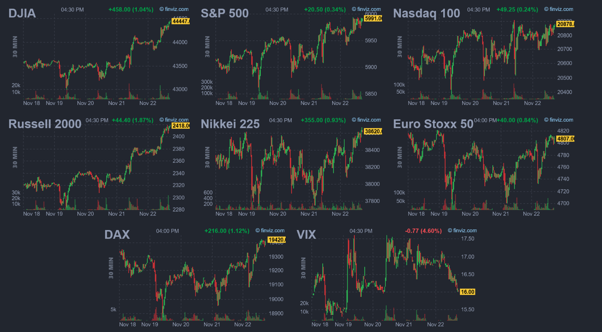

# マーケットコメント（週次簡易コメント）

## 2024/11/22
* 11/18は、[植田日銀総裁発言](https://www.bloomberg.co.jp/news/articles/2024-11-17/SMYQVTT1UM0W00)を受け、12月の利上げを示唆する発言がなかったことから、債券先物は上昇、為替は円安となった。
* 11/19は、ロシアが核兵器の使用基準を引き下げたとの報道から欧州圏中心にリスクオフの動きが強まり、株安・債券高・ドル/円高となったが、米国時間になると持ち直し、概ね往って来いの相場展開。
* 11/21は、ウィリアムズNY連銀総裁がインフレ抑制・利下げの必要性を語った記事と植田総裁の会見ヘッドラインが重なったことで、ドル円は下落。またロシアがICBMをウクライナに発射した旨も伝わるとリスク回避的な円高も相まった。
* 11/22は、欧州圏のPMIが市場予想より大きく下振れたこともあり、ECBの利下げを織り込みつつ欧州債が上昇、EURは下落。EURUSDは1.04ドルを割り込む場面が見られ、パリティ割れが現実実を帯びてきた。
* 来週は金融政策の方向性（日銀の利上げ、FEDの利下げ）と、地政学リスクが交錯し不透明感の高い相場が継続も、サンクスギビングデーがあるため、方向感に欠ける相場展開と思料する。
* 株価 
