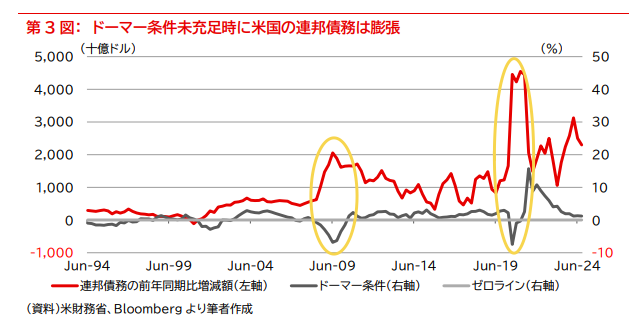

## その他メモやノート

### ドーマー条件
* 経済成長率(g)が金利(r)を下回ってはいけない。（g>r
* [ドーマー条件の原点は、経済成長率が金利を下回ると、利払いの負担が財政を圧迫するため、政府債務が膨張してしまうことである。過去、ドーマー条件が充足されないときには、不連続な債務の膨張が起きている）](https://www.bk.mufg.jp/report/bfrw2025/gmrweekly.pdf)
  * 
  * PERに長期金利を乗じると修正PERといい、配当割引モデルによる理論値の何倍になるかを示す。

### 分析アイデア
* [長期金利の日次変動に意味のある情報とは]<https://www.mizuho-rt.co.jp/publication/mhri/research/pdf/market-insight/MI100512.pdf>
* [国債市場に関する調査研究]<https://www.yu-cho-f.jp/wp-content/uploads/kokusai_honbun30_2.pdf>